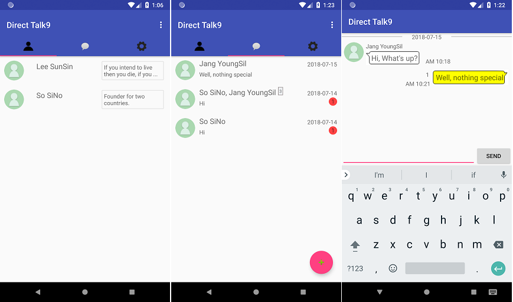

# DirectTalk9 #
This is a messenger app for Android based on Firebase (Cloud Firestore and Realtime Database) for live chat.

This app is suitable for enterprise messenger where all users appears because there is no management function such as add / delete / find friends.

### BRANCHES ###
- master: Cloud Firestore
- realtime: Realtime Database

### FEATURES ###
- 1:1 and Group chat
- Text, Image, File transfer

### INSTALLATION ###
1. Clone this source from github (in android studio).
2. Copy google-services.json to /app folder.

   You can get google-services.json from [Firebase Console](https://support.google.com/firebase/answer/7015592?hl=en)
   
   OR
   
   in android studio, you can make with Tool > Firebase menu 
  
3. Run.
  
   If you see a message like "Please select Android SDK", modify gradle file and run sync now.

4. To use push server(Google Cloud Messaging), you must put the key provided by Firebase in the request header(Authorization) in the sendGCM function in ChatActivity.java.

### License ###
GPL v3